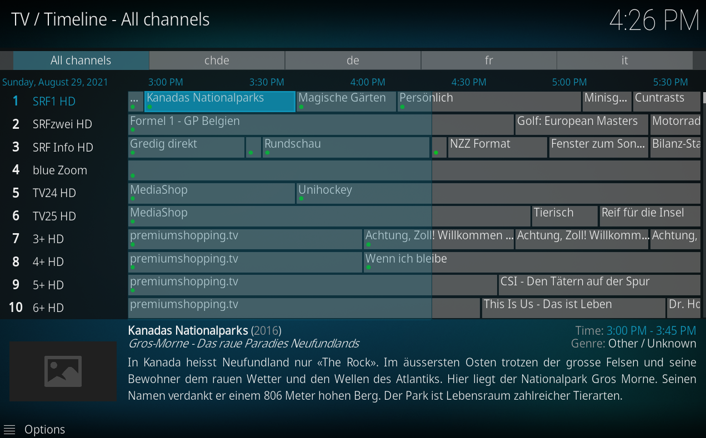
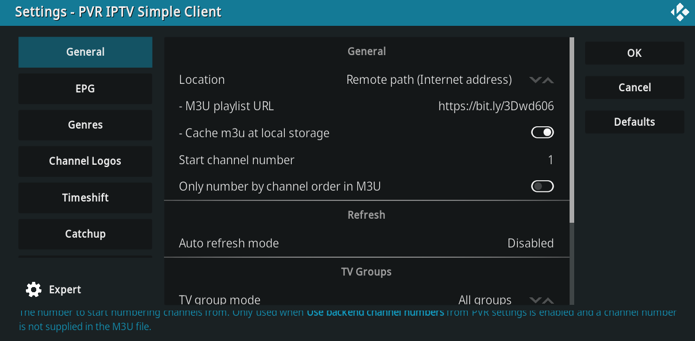
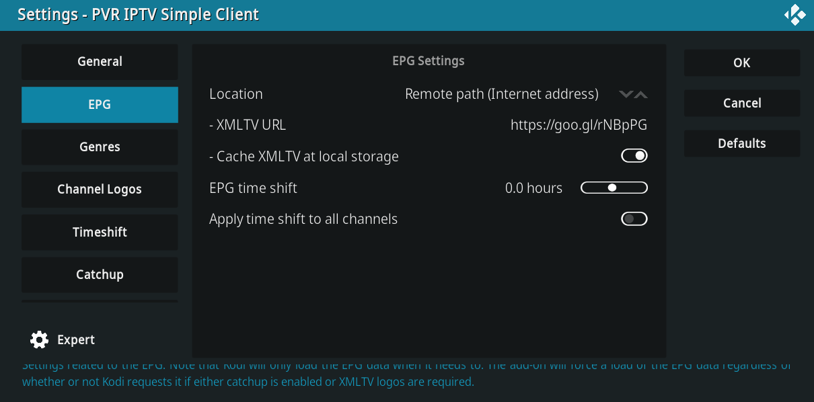
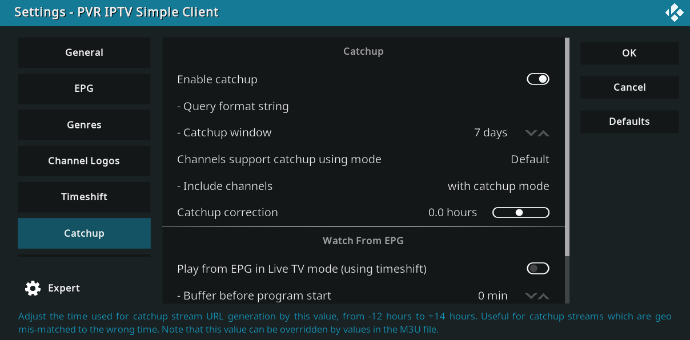

M3U File with Replay Support for TV7 from Init7
===============================================

This is an inofficial M3U File to support Replay TV with TV7 on Kodi using the Simple IPTV PVR Client.

# Configuration in the Simple IPTV PVR Client

* Install the PVR IPTV Simple Client in Kodi.
* Use the URL https://bit.ly/3Dwd606 as M3u playlist URL.

* Use the URL https://goo.gl/rNBpPG from [mathewmeconry's EPG Data](https://github.com/mathewmeconry/TV7_EPG_Data)

* Configure Catch up
  * Enable catchup
  * catchup window `7 days`
  * catchup correct `2.0 hours`
  * include channels `with catchup mode`

# Known caveats
* timing isn't perfect: Since the EPG usually is not 100% accurate the show might not immediately start when you'd expect.
* epg only works for the current day: this is related to the EPG not going much into the past. I opened an [issue](https://github.com/mathewmeconry/TV7_EPG_Data/issues/9) to improve that

# Manually building the file
    npm install
    npm run m3u

# Manually building the epg
    npm install
    npm run epg

The file `TV7-replay.m3u` has been created.